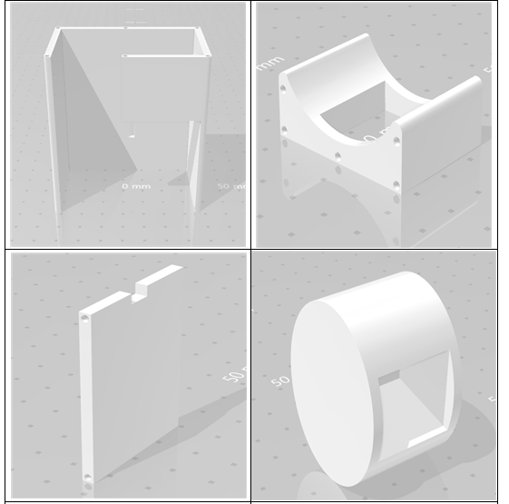
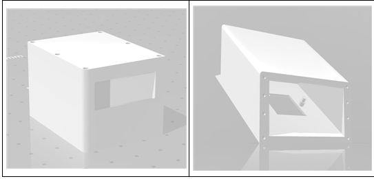
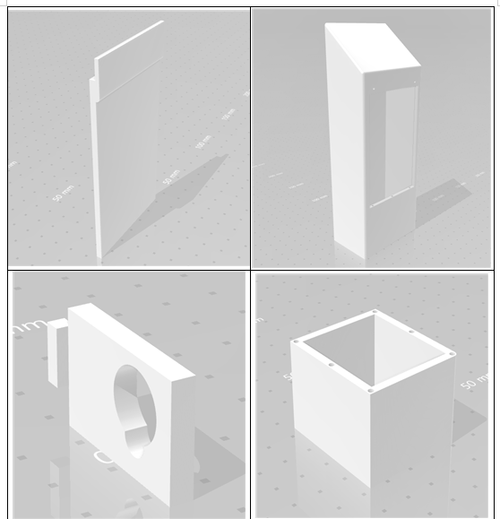
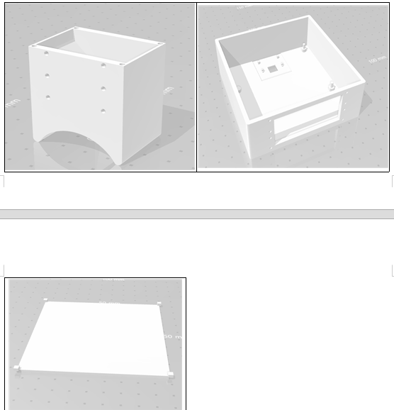
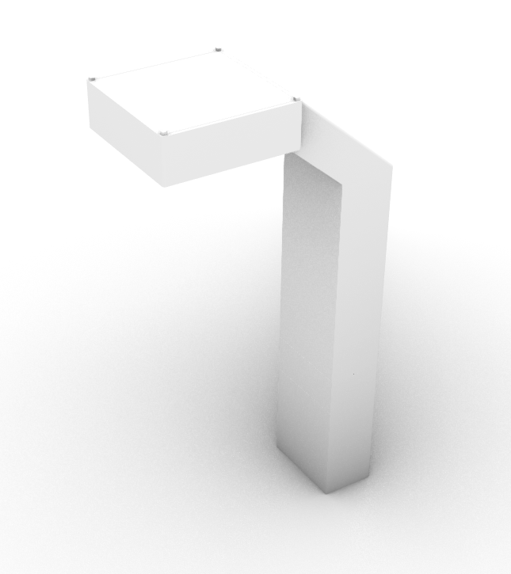
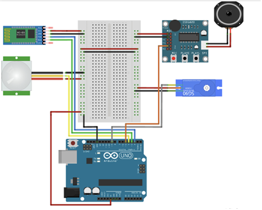
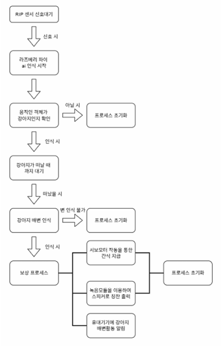

# IoT 프로젝트 통합 보고서 (실습 1~5)
---

# 🐶 실습 1: 3D 프린터 모델링링

## 1. 서론

이 프로젝트는 IOT 펫 용품의 기초가 되는 틀이자, 다자인으로 3d 모델링을 진행한다. 3d 모델링을 할 때 자석의 크기, 나사의 크기를 기본으로 아두이노와 라즈베리파이 선 등을 고려하여 설계하였다.

---

## 2. 디자인 설명


강아지 및 배변의 사각지대 없는 인식을 위해 40x25 사이즈의 배변판을 가정하고, raspberry pi camera 2 모듈의 화각을 고려하여 최소높이를 32cm를 준수하여 설계했다. 모든 모듈 및 배선은 제품 안의 관을 통해 외부로 들어나지 않게 하였으며, 배변판의 중심을 맞추어 밑 기둥에 붙이면 카메라의 범위 안에 들어오도록 스탠드의 모형으로 설계하였다.


---

## 3. 3d 프린터 부품
 
 

---

## 4. 전체 제품 프린터 결과



---
# 🐶 실습 2: YOLOv8 반려동물 인식


## 1. 서론

이 프로젝트는 인공지능(AI) 기반의 반려동물 얼굴 및 행동 인식 모델 개발을 목표로 한다.  
컴퓨터 비전 기술을 활용한 AI는 반려동물 산업에서 건강 관리, 행동 분석 등에 중요한 역할을 할 수 있다.  
본 프로젝트에서는 이미지 수집 및 Bounding Box 라벨링, YOLOv8 기반의 전이 학습을 통해 효율적인 모델을 구축하였고,  
이는 향후 반려동물 관련 AI 서비스 및 연구에 기여할 수 있는 기반이 될 것이다.

---

## 2. 실습 과정 및 코드

### (1) 라벨링 진행


- python 3.9.1 설치
- 구글 Colab 실행

```python
from ultralytics import YOLO
model = YOLO('yolov8n.pt')

!pip install ultralytics -U
```
- 명령 프롬포트 실행

```python
python -m venv labelimg_env
labelimg_env\Scripts\activate
python -m pip install —upgrade pip
pip install labelImg PyQt5 lxml
labelImg # 바로 라벨링 시작
```

### (2) 데이터셋 폴더 구조 변경

```
# 아래 그림처럼 your_dataset 폴더 안의 구조를 정확히 맞추어준다.

your_dataset/
├── images/         # 모든 이미지 파일이 들어갈 폴더
│   ├── train/      # 학습 이미지 (dog__1_.jpg ~ dog__81_.jpg)
│   └── val/        # 검증 이미지 (dog__82_.jpg ~ dog__101_.jpg)
├── labels/         # 모든 라벨 파일이 들어갈 폴더  
│   ├── train/      # 학습 라벨 (dog__1_.txt ~ dog__81_.txt)
│   └── val/        # 검증 라벨 (dog__82_.txt ~ dog__101_.txt)
└── your_dataset.yaml

# 파일 이동: 기존 all_data 폴더에서 dog__N_.jpg 파일들을 images/train/ 또는 images/val/로, dog__N_.txt 파일들을 labels/train/ 또는 labels/val/로 정확히 이동시킵니다.
```

### (3) your_dataset.yaml 작성

```yaml
train: images/train/
val: images/val/
nc: 1
names: ['dog']
# 저장 시 주의 : 반드시 UTF-8 인코딩으로 저장
```

### (4) 구글 드라이브 업로드

- 수정된 your_dataset 폴더를 다시 dog.zip으로 압축
- `dog.zip` 파일을 구글 드라이브에 업로드 (기존파일 존재시 덮어쓰기)
- 코랩에서 아래 순서대로 실행

```python
!pip install ultralytics  #1단계: Ultralytics 라이브러리 설치
from google.colab import drive #2단계: 구글 드라이브 마운트
drive.mount('/content/drive')
!cp "/content/drive/MyDrive/me/dog.zip" /content/ #3단계: dog.zip 파일 코랩 환경으로 복사
!unzip -q /content/dog.zip -d /content/ #4단계: dog.zip 압축 해제
```

### (5) YOLOv8 학습 실행

```python
from ultralytics import YOLO
model = YOLO('yolov8n.pt') #yolov8n모델 로드

results = model.train(
    data='/content/your_dataset/your_dataset.yaml', #수정된 파일 경로
    epochs=50, #학습 반복 횟수
    imgsz=640, #이미지 크기
    batch=16,  #배치 크기
    name='dog_detection_model_folder_structure' #학습 결과 저장
)
```

### (6) 모델 저장

- 구글 드라이브로 저장
  
```python
results_path = '/content/runs/detect/dog_detection_model_folder_structure/'
destination_path = '/content/drive/MyDrive/YOLO_Models/'
!mkdir -p {destination_path}
!cp -r {results_path} {destination_path}
print(f"학습 결과가 '{destination_path}'에 성공적으로 복사되었습니다.")
```

### (7) 모델 예측

```python
model = YOLO('/content/drive/MyDrive/YOLO_Models/dog_detection_model_folder_structure/weights/best.pt') 
test_image_path = '/content/drive/MyDrive/test_dog.jpg' #테스트 할 이미지 경로 입력
results = model.predict(source=test_image_path, save=True, conf=0.5)

for r in results:
    print(f"예측 결과 저장 경로: {r.save_dir}")
print("\n 예측이 완료되었습니다. 결과 이미지는 코랩 파일 탐색기의 'runs/detect/predict' 폴더에서 확인하거나,
저장 경로를 통해 접근할 수 있습니다.")

```
---

## 3. 실습 결과

- 강아지 인식 성공 시, bounding box가 그려진 이미지가 저장됨
- `runs/detect/predict/` 경로에 결과 이미지 확인 가능

- 실습 결과


---

# 🐶 실습 3: OpenCV 얼굴 인식

## 1. 서론

이 프로젝트는 라즈베리파이(Raspberry Pi)와 OpenCV를 활용하여 **실시간 얼굴 인식을 구현**하는 것을 목표로 한다.  
또한, 영상 필터 적용, 중복 저장 방지, 파일 정리 등 다양한 기능 확장도 시도하였다.

---

## 2. 실습 과정 및 코드

### (1) 라즈베리파이 세팅

- Raspberry Pi OS 1.9.4 설치 #sd 카드 굽고 라즈베리와 연결
- SSH 원격 접속 설정 #putty를 이용해 접속 (원격으로 아이피 알기)
- `sudo apt update && sudo apt upgrade`로 최신화

### (2) OpenCV 설치

```bash
sudo apt install python3-opencv -y
```

- 설치 후 `cv2.__version__`으로 정상 설치 확인

### (3) 카메라 설정 확인

- 최신 OS에서는 `libcamera`가 기본
- `libcamera-hello`, `libcamera-vid` 명령어로 카메라 작동 테스트

### (4) 얼굴 인식 기능 구현

```python
face_cascade = cv2.CascadeClassifier(
    cv2.data.haarcascades + 'haarcascade_frontalface_default.xml'
) # 오류발생
```

- 오류로 인해 직접 다운로드해서 사용:

```bash
wget https://github.com/opencv/opencv/raw/master/data/haarcascades/haarcascade_frontalface_default.xml
```

```python
face_cascade = cv2.CascadeClassifier("haarcascade_frontalface_default.xml")
```

### (5) 실시간 필터 적용 기능

- 키보드 입력에 따라 영상 필터 전환:
  - `g`: 그레이스케일
  - `e`: 엣지 감지
  - `s`: 세피아
  - `n`: 원본 유지

---

## 3. 전체 코드 요약 (얼굴 인식 + 필터 적용)

```python
import subprocess
import cv2
import numpy as np

face_cascade = cv2.CascadeClassifier("haarcascade_frontalface_default.xml")
FILTER = 'none'

ffmpeg_cmd = [
    "libcamera-vid",
    "--nopreview", "true",
    "-t", "0",
    "--codec", "mjpeg",
    "-o", "-",
    "--width", "640",
    "--height", "480",
    "--framerate", "15"
]

process = subprocess.Popen(ffmpeg_cmd, stdout=subprocess.PIPE)
buffer = b""

while True:
    chunk = process.stdout.read(1024)
    if not chunk:
        break
    buffer += chunk
    start = buffer.find(b'\xff\xd8')
    end = buffer.find(b'\xff\xd9')
    if start != -1 and end != -1:
        jpg = buffer[start:end + 2]
        buffer = buffer[end + 2:]
        img_array = np.frombuffer(jpg, dtype=np.uint8)
        frame = cv2.imdecode(img_array, cv2.IMREAD_COLOR)

        if frame is not None:
            gray = cv2.cvtColor(frame, cv2.COLOR_BGR2GRAY)
            faces = face_cascade.detectMultiScale(gray, scaleFactor=1.1, minNeighbors=5)
            for (x, y, w, h) in faces:
                cv2.rectangle(frame, (x, y), (x + w, y + h), (0, 255, 0), 2)

            if FILTER == 'gray':
                output = cv2.cvtColor(frame, cv2.COLOR_BGR2GRAY)
            elif FILTER == 'edge':
                output = cv2.Canny(gray, 100, 200)
            elif FILTER == 'sepia':
                kernel = np.array([
                    [0.272, 0.534, 0.131],
                    [0.349, 0.686, 0.168],
                    [0.393, 0.769, 0.189]
                ])
                output = cv2.transform(frame, kernel)
                output = np.clip(output, 0, 255).astype(np.uint8)
            else:
                output = frame

            cv2.imshow("Face + Filter", output)
            key = cv2.waitKey(1) & 0xFF
            if key == ord('q'):
                break
            elif key == ord('g'):
                FILTER = 'gray'
            elif key == ord('e'):
                FILTER = 'edge'
            elif key == ord('s'):
                FILTER = 'sepia'
            elif key == ord('n'):
                FILTER = 'none'

process.terminate()
cv2.destroyAllWindows()
```

---

## 4. 실습 결과 요약

- MJPEG 스트림으로 실시간 얼굴 인식 성공
- 키보드 입력으로 필터 즉시 적용됨
- haarcascade로 얼굴 인식 후 bounding box 표시 완료

- 실습 결과 사진 및 영상
  


---

# 🐶 실습 4: 아두이노 ↔ 라즈베리파이 UART 통신


## 1. 서론

이 프로젝트의 목표는 아두이노와 라즈베리파이 간의 **UART 통신**을 이해하고 직접 구현하는 것이다.  
UART는 전압 변환 없이 간단히 데이터를 주고받을 수 있어 **IoT 및 임베디드 시스템에서 자주 사용**된다.  
아두이노는 센서 및 제어에, 라즈베리파이는 고속 연산과 네트워크 기능에 강점을 가지므로, 두 장치의 연동은 필수적이다.

---

## 2. 실습 과정 및 코드

### (1) 아두이노 코드 업로드

```cpp
void setup() {
  Serial.begin(9600);
  Serial.println("Arduino Ready! Waiting for data from Raspberry Pi via USB...");
}

void loop() {
  if (Serial.available()) {
    char receivedChar = Serial.read();
    Serial.print("Arduino received: ");
    Serial.println(receivedChar);
  }
}
```

- Arduino IDE > Board: Arduino Uno > Port 선택 > Upload 실행

---

### (2) 라즈베리파이 연결 및 파이썬 통신 구현

#### 2-1 라즈베리파이 환경 설정
- SD카드 굽기, SSH 활성화
- 유선랜 또는 와이파이 연결
- 아두이노를 USB-A 포트에 연결 (전압 변환 불필요)

#### 2-2 cmd or PUTTY 실행
```bash 
# (ssh 아이디@ ip주소) -> 비밀번호 임력
sudo apt-get update
sudo apt-get install python3-pip
pip3 install pyserial


#오류로 인해 가상환경 사용시
mkdir my_arduino_project
cd my_arduino_project
python3 -m venv venv
source venv/bin/activate
pip install pyserial
```


#### 2-3 포트 확인 및 설정
```bash
ls /dev/ttyACM*
```

`/boot/firmware/config.txt` 파일에서 `enable_uart=1` 확인

---

### (3) 파이썬 시리얼 통신 코드

```python
import serial
import time

SERIAL_PORT = "/dev/ttyACM0"
BAUD_RATE = 9600

try:
    ser = serial.Serial(SERIAL_PORT, BAUD_RATE, timeout=1)
    print(f"포트 {SERIAL_PORT} 열림")
    time.sleep(2)

    initial_response = ser.readline().decode(errors='ignore').strip()
    if initial_response:
        print(f"초기 응답: {initial_response}")
    else:
        print("초기 응답 없음")

    message_to_send = "안녕하세요 아두이노! (From Raspberry Pi)"
    ser.write(message_to_send.encode())
    time.sleep(0.1)

    response = ser.readline().decode(errors='ignore').strip()
    if response:
        print(f"응답: {response}")
    else:
        print("응답 없음")

    for i in range(1, 6):
        test_message = f"테스트 메시지 {i}번"
        ser.write(test_message.encode())
        time.sleep(0.1)
        received = ser.readline().decode(errors='ignore').strip()
        if received:
            print(f"수신: {received}")
        else:
            print("응답 없음")
        time.sleep(1)

except serial.SerialException as e:
    print(f"시리얼 포트 오류: {e}")
    print("포트 이름 또는 권한 문제일 수 있습니다.")
    print("sudo usermod -a -G dialout $USER")
    print("sudo reboot")

except Exception as e:
    print(f"예외 발생: {e}")

finally:
    if 'ser' in locals() and ser.is_open:
        ser.close()
        print("시리얼 포트 종료")
```

---

## 3. 실습 결과 요약

- UART 통신으로 문자열을 정상적으로 주고받음
- 아두이노는 수신 메시지를 echo 형식으로 응답
- 라즈베리파이에서 시리얼 포트 연결 및 통신 성공

- 실습 결과
  


---

## 📌 참고 사항

- `/dev/ttyACM0` 포트는 상황에 따라 달라질 수 있음
- 실행 전 `enable_uart=1` 설정 필수
- 아두이노가 먼저 USB로 연결되어 있어야 인식됨

---

# 🐶 5. 결과 계획서

## 1. 계획 동기
---

반려동물의 수는 꾸준히 증가하고 있으며, 이와 함께 양육 환경에 대한 요구도 커지고 있다. 특히, 반려동물의 올바른 배변 습관 형성은 보호자와 반려동물 모두의 삶의 질을 높이는 데 핵심적인 요소이다.
 
기존 배변 훈련 방식은 보호자의 지속적인 개입과 인내를 요구하며, 비일관적인 보상으로 인해 훈련 효율성이 떨어지거나 반려동물에게 스트레스를 줄 수 있다는 한계가 있었다. 이러한 문제점을 해결하고 반려동물에게는 스트레스 없는 긍정적인 훈련 경험을, 보호자에게는 효율적이고 편리한 관리 솔루션을 제공하고자 '친화적인 스마트 배변 훈련 시스템' 개발 프로젝트를 기획하였다. 

이 시스템은 최신 임베디드 시스템 기술과 긍정 강화(Positive Reinforcement) 학습 이론을 결합하여, 반려동물의 배변 훈련 효율성을 극대화하는 혁신적인 자동화 솔루션을 제시한다.

---

## 2. 제품 소개

### 1. 제품 회로 설명

스마트 배변 훈련 시스템의 핵심은 정교한 자동 배변 감지 및 인식 기능과 이에 따른 즉각적인 긍정 강화 보상 메커니즘에 있다. 시스템의 작동 원리는 다음과 같다. 배변 패드 상단에 전략적으로 설치된 라즈베리파이 카메라는 배변 패드 전반을 실시간으로 모니터링한다.

그 후 카메라로부터 입력되는 영상 데이터는 라즈베리파이 보드에서 실행되는 고급 이미지 처리 및 배변 감지 알고리즘을 통해 분석된다. 이 알고리즘은 반려동물의 배변 행위를 정확하게 식별하고 인식하는 역할을 수행한다. 

배변 감지를 위해 OpenCV 라이브러리를 활용한 이미지 전처리 및 분석과 함께, YOLOv8n (You Only Look Once version 8 nano) 모델을 기반으로 한 객체 탐지 알고리즘을 적용하였다. YOLOv8n은 그 가볍고 빠른 처리 속도로 인해 라즈베리파이와 같은 임베디드 환경에 적용하기에 성능 부담이 적다는 장점이 있어 최종 선정되었다. 

또한, 배변 감지를 위해 대략 100장의 강아지 이미지로 모델을 학습시켰으며, 특히 카메라의 설치 위치와 강아지의 상대적인 위치 차이를 고려하여 강아지의 등 및 위쪽 모습을 위주로 라벨링을 진행하였다. 이는 배변 전후 강아지의 특정 자세(예: 웅크리는 자세)와 배변물을 집중적으로 인식하는 데 최적화된 접근 방식이다. 이러한 맞춤형 학습을 통해 배변이 성공적으로 이루어졌을 때를 정밀하게 식별할 수 있도록 구현하였다.

배변이 성공적으로 감지되고 인식되면, 시스템은 사전에 설정된 긍정 강화 보상 메커니즘을 즉각적으로 작동시킨다. 시스템의 제어를 담당하는 아두이노 UNO 보드에 연결된 서보 모터로 제어되는 간식 배급기가 자동으로 개폐되며, 소량의 간식을 반려동물에게 제공한다. 

간식 배급기는 원통형 구조로 설계되었으며, 서보모터 SG90을 이용하여 회전식으로 작동한다. 원통의 크기에 맞춰 간식을 투입할 수 있어 간식의 양 조절에 용이하다는 특징이 있다. 이러한 즉각적인 보상은 파블로프의 조건반사와 같이 반려동물이 특정 장소(배변 패드)에서의 배변 행위와 긍정적인 경험(맛있는 간식)을 강력하게 연관 짓게 한다. 

 이는 단순히 배변 습관을 형성하는 것을 넘어, 반려동물이 배변 훈련 자체를 즐겁고 긍정적인 활동으로 인식하도록 돕는 강력한 학습 효과를 유도한다. 결과적으로 올바른 배변 습관은 더욱 빠르고 견고하게 자리 잡게 될 것으로 기대된다. 라즈베리파이와 아두이노 UNO 두 핵심 보드는 UART(Universal Asynchronous Receiver/Transmitter) 직렬 통신 프로토콜을 통해 서로 끊임없이 데이터를 주고받으며 긴밀하게 협력한다. 

라즈베리파이가 배변 감지 후 아두이노에게 보상 명령을 내리면, 아두이노는 이를 즉시 실행하고, 필요에 따라 자신의 상태 정보를 라즈베리파이로 다시 전송한다. 이러한 안정적이고 신속한 양방향 통신은 시스템이 오차 없이 원활하게 작동하도록 보장하는 핵심적인 기술 요소이다.
또한, 보상 프로세스가 작동되게 되면 보호자에게 알림이 가는 어플을 통해 반려동물이 훈련이 잘되고 있는지를 확인할 수 있도록 할 예정이다.

#### 1-1 아두이노 제품 회로도



#### 1-2. 제품 흐름도



### 2. 제품 모델링

이 제품은 반려동물과 보호자 모두에게 최적의 환경을 제공하는 사용자 친화적인 디자인을 갖추고 있다. 아두이노, 라즈베리파이 등 모든 주요 전자 부품과 회로는 배변 패드 하단에 교묘하게 빌트인되어 외부로 노출되지 않는다. 

초기 모델링 시 제품의 전체적인 크기가 컸으나, 3D 프린터를 활용하여 모든 부품을 출력하는 과정에서 디자인을 상당히 간소화하고 축소하였다. 이로 인해 외관은 단순해 보이지만, 내부에 모든 부품을 효율적으로 배치할 수 있도록 구조가 정교하게 설계되었다. 이는 미관을 해치지 않을 뿐만 아니라, 반려동물이 호기심에 부품을 건드리거나 손상시킬 위험을 원천적으로 차단하여 안전성을 극대화한다. 

 카메라는 배변 패드 가장자리에 위치한 안정적인 기둥에 설치되어 강아지의 움직임에 전혀 방해를 주지 않으면서도 배변 패드 전역을 한눈에 담을 수 있는 최적의 시야각을 확보한다. 이러한 세심한 디자인은 반려동물이 시스템의 존재를 거의 인식하지 못하고 자연스러운 환경에서 배변 훈련을 받을 수 있도록 돕는다. 이는 훈련 과정에서 발생할 수 있는 스트레스를 최소화하고, 반려동물의 거부감 없이 시스템을 받아들이게 하는 데 기여한다. 

색상은 강아지가 좋아한다고 알려진 밝은 계열의 필라멘트로 작업을 할 예정이며, 약 13개의 부품을 조립하는 형태로 작업을 진행할 예정이다. 또한 조립 형태는 나사와 접착제를 이용하고 간식통과 같은 열고 닫는 부품엔 2mm의 작은 자석을 여러개 붙여 조립을 할 예정이다.


 #### 2-1 제품 모델링 사진


---

## 3.제품 개선 방안

이러한 제품을 개발하는 과정에서는 몇 가지 기술적 및 설계적 도전 과제에 직면하였고, 이를 해결하기 위한 노력을 통해 시스템의 완성도를 높일 수 있었다. 첫째, 초기 YOLOv8n 모델 학습 시 약 100장의 이미지로 학습을 진행하였으나, 강아지의 얼굴이 아닌 후면 부분의 인식률은 떨어지는 경향을 보였다. 이는 배변 행위 감지의 정확도에 영향을 미치는 문제였으므로, 향후 데이터 수를 늘려 추가적인 학습을 진행하여 모델의 인식률과 정확도를 개선할 계획이다. 

 둘째, 라즈베리파이와 아두이노 간의 UART 직렬 통신 시 간헐적인 데이터 손실 문제가 발생하였다. 이는 시스템의 즉각적인 보상 메커니즘에 직접적인 영향을 미치는 문제였으므로, 통신 프로토콜을 재정의하고 데이터 전송 시 체크섬(checksum)을 포함하는 등 에러 핸들링 로직을 강화하여 통신 안정성을 확보하였다. 

 셋째, 간식 배급기의 서보 모터 제어 시 특정 크기 간식의 걸림 문제가 발생하였다. 이를 해결하기 위해 간식 투입구의 3D 모델링 디자인을 여러 차례 수정하여 마찰을 최소화하고, 서보 모터의 회전 각도 및 속도를 정밀하게 튜닝하여 간식이 원활하게 배출되도록 최적화하였다. 마지막으로, 모든 전자 부품과 회로를 배변 패드 하단에 빌트인하는 과정에서 내부 공간 활용의 어려움과 3D 프린팅 출력물의 강성 문제가 있었다. 이에 초기 모델링된 디자인을 과감히 간소화하고 축소하는 방향으로 설계를 변경하였으며, 3D 프린팅 시 출력물의 충전율(Infill Density)을 높이고 하중을 최대한 수직으로 받는 구조를 적용하여 견고하면서도 효율적인 내부 공간 설계를 완성할 수 있었다.

 ---

 ## 4. 기대효과

 궁극적으로 본 '사용자 친화적인 스마트 배변 훈련 시스템'은 실시간 정밀 모니터링, 자동화된 즉각적 보상, 그리고 지능적인 통합 제어를 통해 반려동물에게는 스트레스 없는 긍정적인 훈련 경험을, 보호자에게는 효율적이고 편리한 반려동물 관리 솔루션을 제공하는 것을 목표로 한다. 본 시스템은 단순한 기술적 구현을 넘어, 반려동물과 보호자의 삶의 질을 실질적으로 향상시킬 수 있는 의미 있는 솔루션이 될 것이라 확신한다.

 


