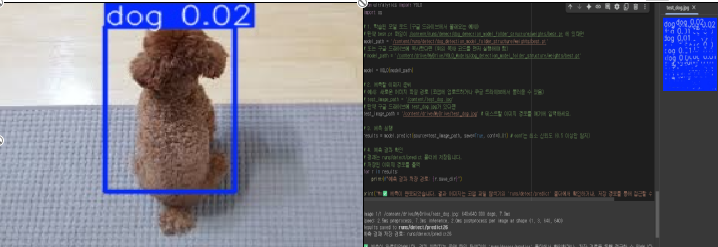
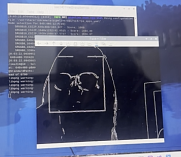

# IoT 프로젝트 통합 보고서 (실습 1~5)

---

# 🐶 실습 2: YOLOv8 반려동물 인식


## 1. 서론

이 프로젝트는 인공지능(AI) 기반의 반려동물 얼굴 및 행동 인식 모델 개발을 목표로 한다.  
컴퓨터 비전 기술을 활용한 AI는 반려동물 산업에서 건강 관리, 행동 분석 등에 중요한 역할을 할 수 있다.  
본 프로젝트에서는 이미지 수집 및 Bounding Box 라벨링, YOLOv8 기반의 전이 학습을 통해 효율적인 모델을 구축하였고,  
이는 향후 반려동물 관련 AI 서비스 및 연구에 기여할 수 있는 기반이 될 것이다.

---

## 2. 실습 과정 및 코드

### (1) 데이터셋 폴더 구조 변경
```
# 아래 그림처럼 your_dataset 폴더 안의 구조를 정확히 맞추어준다.

your_dataset/
├── images/         # 모든 이미지 파일이 들어갈 폴더
│   ├── train/      # 학습 이미지 (dog__1_.jpg ~ dog__81_.jpg)
│   └── val/        # 검증 이미지 (dog__82_.jpg ~ dog__101_.jpg)
├── labels/         # 모든 라벨 파일이 들어갈 폴더  
│   ├── train/      # 학습 라벨 (dog__1_.txt ~ dog__81_.txt)
│   └── val/        # 검증 라벨 (dog__82_.txt ~ dog__101_.txt)
└── your_dataset.yaml

# 파일 이동: 기존 all_data 폴더에서 dog__N_.jpg 파일들을 images/train/ 또는 images/val/로, dog__N_.txt 파일들을 labels/train/ 또는 labels/val/로 정확히 이동시킵니다.
```

### (2) your_dataset.yaml 작성
```yaml
train: images/train/
val: images/val/
nc: 1
names: ['dog']
# 저장 시 주의 : 반드시 UTF-8 인코딩으로 저장
```
---

### (3) 구글 드라이브 업로드

- 수정된 your_dataset 폴더를 다시 dog.zip으로 압축
- `dog.zip` 파일을 구글 드라이브에 업로드 (기존파일 존재시 덮어쓰기)
- 코랩에서 아래 순서대로 실행

```python
!pip install ultralytics  #1단계: Ultralytics 라이브러리 설치
from google.colab import drive #2단계: 구글 드라이브 마운트
drive.mount('/content/drive')
!cp "/content/drive/MyDrive/me/dog.zip" /content/ #3단계: dog.zip 파일 코랩 환경으로 복사
!unzip -q /content/dog.zip -d /content/ #4단계: dog.zip 압축 해제
```

---

### (4) YOLOv8 학습 실행

```python
from ultralytics import YOLO
model = YOLO('yolov8n.pt') #yolov8n모델 로드

results = model.train(
    data='/content/your_dataset/your_dataset.yaml', #수정된 파일 경로
    epochs=50, #학습 반복 횟수
    imgsz=640, #이미지 크기
    batch=16,  #배치 크기
    name='dog_detection_model_folder_structure' #학습 결과 저장
)
```

---

### (5) 모델 저장

- 구글 드라이브로 저장
```python
results_path = '/content/runs/detect/dog_detection_model_folder_structure/'
destination_path = '/content/drive/MyDrive/YOLO_Models/'
!mkdir -p {destination_path}
!cp -r {results_path} {destination_path}
print(f"학습 결과가 '{destination_path}'에 성공적으로 복사되었습니다.")
```

---

### (6) 모델 예측

```python
model = YOLO('/content/drive/MyDrive/YOLO_Models/dog_detection_model_folder_structure/weights/best.pt') 
test_image_path = '/content/drive/MyDrive/test_dog.jpg' #테스트 할 이미지 경로 입력
results = model.predict(source=test_image_path, save=True, conf=0.5)

for r in results:
    print(f"예측 결과 저장 경로: {r.save_dir}")
print("\n 예측이 완료되었습니다. 결과 이미지는 코랩 파일 탐색기의 'runs/detect/predict' 폴더에서 확인하거나,
저장 경로를 통해 접근할 수 있습니다.")

```
---

## 3. 실습 결과

- 강아지 인식 성공 시, bounding box가 그려진 이미지가 저장됨
- `runs/detect/predict/` 경로에 결과 이미지 확인 가능
- 

---

# 🐶 실습 3: OpenCV 얼굴 인식

## 1. 서론

이 프로젝트는 라즈베리파이(Raspberry Pi)와 OpenCV를 활용하여 **실시간 얼굴 인식을 구현**하는 것을 목표로 한다.  
또한, 영상 필터 적용, 중복 저장 방지, 파일 정리 등 다양한 기능 확장도 시도하였다.

---

## 2. 실습 과정 및 코드

### (1) 라즈베리파이 세팅

- Raspberry Pi OS 1.9.4 설치 #sd 카드 굽고 라즈베리와 연결
- SSH 원격 접속 설정 #putty를 이용해 접속 (원격으로 아이피 알기)
- `sudo apt update && sudo apt upgrade`로 최신화

### (2) OpenCV 설치

```bash
sudo apt install python3-opencv -y
```

- 설치 후 `cv2.__version__`으로 정상 설치 확인

### (3) 카메라 설정 확인

- 최신 OS에서는 `libcamera`가 기본
- `libcamera-hello`, `libcamera-vid` 명령어로 카메라 작동 테스트

### (4) 얼굴 인식 기능 구현

```python
face_cascade = cv2.CascadeClassifier(
    cv2.data.haarcascades + 'haarcascade_frontalface_default.xml'
) # 오류발생
```

- 오류로 인해 직접 다운로드해서 사용:

```bash
wget https://github.com/opencv/opencv/raw/master/data/haarcascades/haarcascade_frontalface_default.xml
```

```python
face_cascade = cv2.CascadeClassifier("haarcascade_frontalface_default.xml")
```

### (5) 실시간 필터 적용 기능

- 키보드 입력에 따라 영상 필터 전환:
  - `g`: 그레이스케일
  - `e`: 엣지 감지
  - `s`: 세피아
  - `n`: 원본 유지

---

## 3. 전체 코드 요약 (얼굴 인식 + 필터 적용)

```python
import subprocess
import cv2
import numpy as np

face_cascade = cv2.CascadeClassifier("haarcascade_frontalface_default.xml")
FILTER = 'none'

ffmpeg_cmd = [
    "libcamera-vid",
    "--nopreview", "true",
    "-t", "0",
    "--codec", "mjpeg",
    "-o", "-",
    "--width", "640",
    "--height", "480",
    "--framerate", "15"
]

process = subprocess.Popen(ffmpeg_cmd, stdout=subprocess.PIPE)
buffer = b""

while True:
    chunk = process.stdout.read(1024)
    if not chunk:
        break
    buffer += chunk
    start = buffer.find(b'\xff\xd8')
    end = buffer.find(b'\xff\xd9')
    if start != -1 and end != -1:
        jpg = buffer[start:end + 2]
        buffer = buffer[end + 2:]
        img_array = np.frombuffer(jpg, dtype=np.uint8)
        frame = cv2.imdecode(img_array, cv2.IMREAD_COLOR)

        if frame is not None:
            gray = cv2.cvtColor(frame, cv2.COLOR_BGR2GRAY)
            faces = face_cascade.detectMultiScale(gray, scaleFactor=1.1, minNeighbors=5)
            for (x, y, w, h) in faces:
                cv2.rectangle(frame, (x, y), (x + w, y + h), (0, 255, 0), 2)

            if FILTER == 'gray':
                output = cv2.cvtColor(frame, cv2.COLOR_BGR2GRAY)
            elif FILTER == 'edge':
                output = cv2.Canny(gray, 100, 200)
            elif FILTER == 'sepia':
                kernel = np.array([
                    [0.272, 0.534, 0.131],
                    [0.349, 0.686, 0.168],
                    [0.393, 0.769, 0.189]
                ])
                output = cv2.transform(frame, kernel)
                output = np.clip(output, 0, 255).astype(np.uint8)
            else:
                output = frame

            cv2.imshow("Face + Filter", output)
            key = cv2.waitKey(1) & 0xFF
            if key == ord('q'):
                break
            elif key == ord('g'):
                FILTER = 'gray'
            elif key == ord('e'):
                FILTER = 'edge'
            elif key == ord('s'):
                FILTER = 'sepia'
            elif key == ord('n'):
                FILTER = 'none'

process.terminate()
cv2.destroyAllWindows()
```

---

## 4. 실습 결과 요약

- MJPEG 스트림으로 실시간 얼굴 인식 성공
- 키보드 입력으로 필터 즉시 적용됨
- haarcascade로 얼굴 인식 후 bounding box 표시 완료

---
- 실습 결과 사진 및 영상

---


---

# 🐶 실습 4: 아두이노 ↔ 라즈베리파이 UART 통신


## 1. 서론

이 프로젝트의 목표는 아두이노와 라즈베리파이 간의 **UART 통신**을 이해하고 직접 구현하는 것이다.  
UART는 전압 변환 없이 간단히 데이터를 주고받을 수 있어 **IoT 및 임베디드 시스템에서 자주 사용**된다.  
아두이노는 센서 및 제어에, 라즈베리파이는 고속 연산과 네트워크 기능에 강점을 가지므로, 두 장치의 연동은 필수적이다.

---

## 2. 실습 과정 및 코드

### (1) 아두이노 코드 업로드

```cpp
void setup() {
  Serial.begin(9600);
  Serial.println("Arduino Ready! Waiting for data from Raspberry Pi via USB...");
}

void loop() {
  if (Serial.available()) {
    char receivedChar = Serial.read();
    Serial.print("Arduino received: ");
    Serial.println(receivedChar);
  }
}
```

- Arduino IDE > Board: Arduino Uno > Port 선택 > Upload 실행

---

### (2) 라즈베리파이 연결 및 파이썬 통신 구현

#### 2-1 라즈베리파이 환경 설정
- SD카드 굽기, SSH 활성화
- 유선랜 또는 와이파이 연결
- 아두이노를 USB-A 포트에 연결 (전압 변환 불필요)

#### 2-2 cmd or PUTTY 실행
```bash 
# (ssh 아이디@ ip주소) -> 비밀번호 임력
sudo apt-get update
sudo apt-get install python3-pip
pip3 install pyserial


#오류로 인해 가상환경 사용시
mkdir my_arduino_project
cd my_arduino_project
python3 -m venv venv
source venv/bin/activate
pip install pyserial
```


#### 2-3 포트 확인 및 설정
```bash
ls /dev/ttyACM*
```

`/boot/firmware/config.txt` 파일에서 `enable_uart=1` 확인

---

### (3) 파이썬 시리얼 통신 코드

```python
import serial
import time

SERIAL_PORT = "/dev/ttyACM0"
BAUD_RATE = 9600

try:
    ser = serial.Serial(SERIAL_PORT, BAUD_RATE, timeout=1)
    print(f"포트 {SERIAL_PORT} 열림")
    time.sleep(2)

    initial_response = ser.readline().decode(errors='ignore').strip()
    if initial_response:
        print(f"초기 응답: {initial_response}")
    else:
        print("초기 응답 없음")

    message_to_send = "안녕하세요 아두이노! (From Raspberry Pi)"
    ser.write(message_to_send.encode())
    time.sleep(0.1)

    response = ser.readline().decode(errors='ignore').strip()
    if response:
        print(f"응답: {response}")
    else:
        print("응답 없음")

    for i in range(1, 6):
        test_message = f"테스트 메시지 {i}번"
        ser.write(test_message.encode())
        time.sleep(0.1)
        received = ser.readline().decode(errors='ignore').strip()
        if received:
            print(f"수신: {received}")
        else:
            print("응답 없음")
        time.sleep(1)

except serial.SerialException as e:
    print(f"시리얼 포트 오류: {e}")
    print("포트 이름 또는 권한 문제일 수 있습니다.")
    print("sudo usermod -a -G dialout $USER")
    print("sudo reboot")

except Exception as e:
    print(f"예외 발생: {e}")

finally:
    if 'ser' in locals() and ser.is_open:
        ser.close()
        print("시리얼 포트 종료")
```

---

## 3. 실습 결과 요약

- UART 통신으로 문자열을 정상적으로 주고받음
- 아두이노는 수신 메시지를 echo 형식으로 응답
- 라즈베리파이에서 시리얼 포트 연결 및 통신 성공

- 실습 결과


---

## 📌 참고 사항

- `/dev/ttyACM0` 포트는 상황에 따라 달라질 수 있음
- 실행 전 `enable_uart=1` 설정 필수
- 아두이노가 먼저 USB로 연결되어 있어야 인식됨
